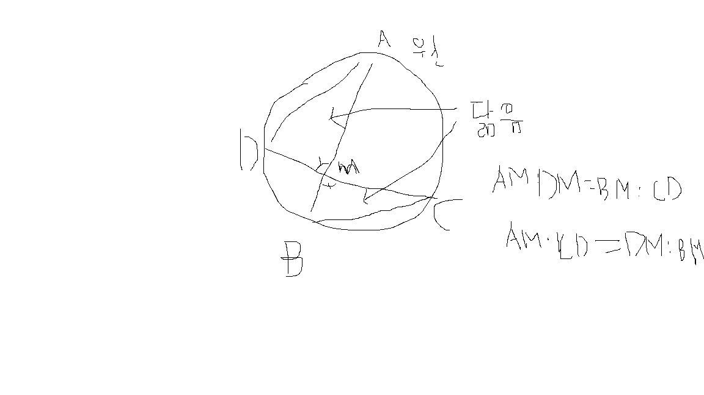

# Q1. 원 접기

## 문제
종이접기를 좋아하는 구름이는 원 모양 종이를 접힌 선분 사이에 교점이 생기도록 두 번 접었다 펴려고 한다. 원을 첫 번째 접었다 편 후 생기는 선분의 양 끝점을 $A$, $B$, 두 번째 접었다 편 후 생기는 선분의 양 끝점을 $C$, $D$라고 할 때, 두 선분 $AB$와 $CD$가 교점을 $M$이라고 하자. $|AM|$, $|CM|$, $|BM|$이 주어질 경우 $|DM|$을 계산하여 기약분수 $\frac{a}{b}$로 나타낼 때, $a$와 $b$를 구하여라.

## 입력
첫째 줄에 $|AM|$, $|CM|$, $|BM|$이 공백을 두고 주어진다.

* $1 \le |AM|, |CM|, |BM| \le 10,000$
* 주어지는 모든 수는 정수이다.

## 출력
첫째 줄에 $a$와 $b$를 공백을 두고 출력한다.

## 입출력 예시

**예시 1**
* 입력: $5 \ 5 \ 5$
* 출력: $5 \ 1$
```python
# Q1. 원 접기
# -*- coding: utf-8 -*-
# UTF-8 encoding when using korean
import math
AM, CM, BM = map(int, input().split())
a, b = AM*BM , CM
gcd = math.gcd(a, b)
a = AM*BM // gcd
b =  CM // gcd
print(a, b)
```

## 풀이과정


$AM \times CM = DM \times BM$

$\frac{AM \times BM}{CM} = DM$

$a = AM \times BM$

$b = CM$

약분을 해주는 알고리즘을 구상해야 한다

그말은 최대공약수를 구하는 알고리즘을 짜야한다

제미나이에게 최대공약수 함수를 소개받았다.


# Q2. 딱지놀이

## 문제
두 어린이 $A, B$가 딱지놀이를 한다. 딱지에는 별($4$), 동그라미($3$), 네모($2$), 세모($1$)의 네 가지 모양이 그려져 있다.

두 어린이가 낸 딱지의 승패는 다음 규칙에 따라 결정된다.
1. 만약 별($4$)의 개수가 다르다면, 별이 많은 쪽이 이긴다.
2. 별의 개수가 같고 동그라미($3$)의 개수가 다르다면, 동그라미가 많은 쪽이 이긴다.
3. 별과 동그라미의 개수가 같고 네모($2$)의 개수가 다르다면, 네모가 많은 쪽이 이긴다.
4. 별, 동그라미, 네모의 개수가 같고 세모($1$)의 개수가 다르다면, 세모가 많은 쪽이 이긴다.
5. 모든 모양의 개수가 같다면 무승부($D$)이다.

## 입력
첫째 줄에는 딱지놀이의 총 라운드 수를 나타내는 자연수 $N$이 주어진다. ($1 \le N \le 1,000$)
다음 줄부터 $N$개 라운드에 대한 정보가 주어진다. 각 라운드는 두 줄로 구성된다.
- 첫 번째 줄: 어린이 $A$가 낸 딱지의 그림 개수 $a$와 그 뒤로 $a$개의 정수(모양 번호)가 공백을 두고 주어진다.
- 두 번째 줄: 어린이 $B$가 낸 딱지의 그림 개수 $b$와 그 뒤로 $b$개의 정수(모양 번호)가 공백을 두고 주어진다.
($1 \le a, b \le 100$, 각 모양 번호는 $1, 2, 3, 4$ 중 하나)

## 출력
표준 출력으로 총 $N$줄을 출력한다. 각 줄에는 해당 라운드의 승자($A$ 또는 $B$)를 출력하고, 무승부인 경우 $D$를 출력한다.

## 입출력 예시

**예시 1**
* 입력: 
$5$

$1 \ 4$

$4 \ 3 \ 3 \ 2 \ 1$

$5 \ 2 \ 4 \ 3 \ 2 \ 1$

$4 \ 4 \ 3 \ 3 \ 1$

$4 \ 3 \ 2 \ 1 \ 1$

$4 \ 2 \ 3 \ 2 \ 1$

$4 \ 4 \ 3 \ 2 \ 1$

$3 \ 4 \ 3 \ 2$

$5 \ 2 \ 4 \ 1 \ 4 \ 3$

$1 \ 4$

* 출력: 
$A$

$B$

$B$

$A$

$D$


## 예제 설명
- 라운드 $1$: $A$는 별($4$) $1$개, $B$는 별이 없음. 따라서 $A$ 승리.
- 라운드 $2$: $A$는 별($4$) $1$개, $B$는 별($4$) $2$개. 따라서 $B$ 승리.
- 라운드 $3$: 별($4$) 개수가 같으나, 동그라미($3$) 개수에서 $B$가 $2$개로 $A$($1$개)보다 많음. 따라서 $B$ 승리.
- 라운드 $4$: 별($4$) $1$개로 같고 동그라미($3$) $1$개로 같음. 네모($2$) 개수에서 $A$($1$개)가 $B$($0$개)보다 많음. 따라서 $A$ 승리.
- 라운드 $5$: 모든 모양의 개수가 별($4$) $1$개로 동일함. 따라서 무승부 $D$.


```python
# Q2. [KOI 2017] 딱지놀이
# -*- coding: utf-8 -*-
# UTF-8 encoding when using korean
# Q2. [KOI 2017] 딱지놀이
# -*- coding: utf-8 -*-
# UTF-8 encoding when using korean
def count_values(arr : list):
    result = 0
    for i in range(1,4+1):
        result += ((1000 ** (i-1))*arr.count(i))
    return result

def compare(a, b):
    a_result, b_result = count_values(a), count_values(b)
    if a_result == b_result:
        print("D")
    else :
        print("A" if a_result>b_result else "B")

N = int(input())
for i in range(N):
    a = list(map(int, input().split()))[1:]
    b = list(map(int, input().split()))[1:]
    compare(a,b)
```

## 풀이과정
삼상 연산자를 통해 결과값을 출력하고, 

어차피 별모양부터 비교를 하므로

각 자리별로 1000을 곱해

별이 3개, 동그라미 22개, 네모 35개, 세모 100개면

3,022,035,100로 반환하여 비교하기 쉽도록 하였다


# Q3. 놀이공원

## 문제
어느 한 도시에서는 공장 부지가 부도가 나게 되어 넓은 공터가 경매에 올라오게 되었다. 이 공터는 가로와 세로 길이가 각각 $N$인 정사각형 모양이며, 가로와 세로 길이가 $1$인 정사각형 격자 모양으로 영역을 나누어 개별적으로 판매하고 있다.

그 도시에 살고 있던 한 부자 경영인은 평소 자신이 기획해오던 놀이공원 건설 프로젝트를 진행하기로 결정하였다. 때마침 경매에 올라온 이 공터에 관심을 가지게 된 경영인은 판매 중인 땅들 중 일부에 기존의 공장에서 배출된 폐기물들이 방치되어 있다는 사실을 알게 되었다.

놀이공원 건설을 위해서는 가로와 세로 길이가 $K$인 정사각형 모양의 영역이 필요한데, 당연히 놀이공원 건설을 위해서는 해당 영역의 폐기물들을 모두 처리해야만 한다. $N \times N$ 격자 모양의 공터에서 $K \times K$ 크기의 땅을 구매하려고 할 때, 구매할 땅에 포함된 폐기물의 수를 최소화하는 영역을 찾는 프로그램을 작성하라.

## 입력
첫째 줄에는 테스트 케이스의 개수 $T$가 주어진다. 각 테스트 케이스의 입력은 아래와 같은 형식을 따른다.

첫째 줄에는 공터의 크기를 나타내는 $N$과 구매할 땅의 크기를 나타내는 $K$가 공백을 두고 주어진다.
다음 $N$개의 줄에는 공터의 정보를 나타내는 정수가 한 줄에 $N$개씩 공백을 두고 주어진다. 주어지는 정수는 $0$ 또는 $1$이며, $0$은 해당 칸이 비어있음을, $1$은 해당 칸에 폐기물이 있음을 의미한다.

* $1 \le T \le 100$
* $1 \le N \le 100$
* $1 \le K \le N$

## 출력
각 테스트 케이스에 대해, $K \times K$ 모양의 땅을 구매했을 때 처리해야 하는 최소 폐기물의 수를 한 줄에 하나씩 출력한다.

## 입출력 예시

**예시 1**
* 입력: 

$1$

$5 \ 3$

$1 \ 0 \ 0 \ 0 \ 1$

$0 \ 0 \ 0 \ 0 \ 0$

$0 \ 0 \ 1 \ 0 \ 0$

$0 \ 0 \ 1 \ 0 \ 0$

$0 \ 0 \ 0 \ 0 \ 1$

* 출력: 

$1$


```python
# Q3. 놀이공원
# -*- coding: utf-8 -*-
# UTF-8 encoding when using korean
import numpy as np

T = int(input()) #테스트 케이스 개수
for _ in range(T):
    N, K = map(int,input().split())#공터크기, 땅의크기
    arr = np.array(
        [list(map(int, input().split())) for _ in range(N)]
        )

    min_num = float('inf')
    for i in range(N+1-K):
        for j in range((N+1-K)):
            temp = np.sum(arr[i:i+K, j:j+K])
            if temp < min_num:
                min_num = temp
    print(min_num)

```

## 풀이과정

**난이도 3 문제**

numpy의 `numpy.sum()`을 통해 해결 할 수 있을 것 같아

numpy를 사용했다

리스트 컴프리헨션을 통해 값을 한번에 입력받도록 했다

배열에 `numpyp.sum()`값을 넣은 다음

`min()`함수를 통해 출력하려다가,

그냥 temp 변수를 사용해 최저값을 출력했다.

# Q4. 구름 크기 측정하기

## 문제
구름이는 구름의 크기를 측정하려고 한다. 구름이는 가로의 길이가 $N$, 세로의 길이가 $M$인 직사각형 모양이다.

구름이가 측정한 가로의 길이 $N$과 세로의 길이 $M$이 주어졌을 때, 구름의 크기를 출력하시오.

구름의 크기는 가로의 길이와 세로의 길이를 곱한 값이다.

## 입력
첫째 줄에 가로의 길이 $N$과 세로의 길이 $M$이 공백을 두고 주어진다.

* $1 \le N, M \le 1,000,000$

## 출력
구름의 크기를 출력한다.

## 입출력 예시

**예시 1**
* 입력: 

$10 \ 20$

* 출력: 

$200$

**예시 2**
* 입력: 

$5 \ 5$

* 출력: 

$25$


```python
# Q4. 구름 크기 측정하기
# -*- coding: utf-8 -*-
# UTF-8 encoding when using korean
N, M = map(int, input().split())
print(N*M)
```

## 풀이과정
입력받은 두 값을 곱해주기만 하면 되는 간단한 문제

# Q5. 헷갈리는 작대기

## 문제
구름이는 $1$번부터 $4$번까지 총 네 종류의 작대기를 구분하는 프로그램을 작성하려고 한다. 각 작대기의 모양은 아래와 같다.

- $1$번 작대기: `1` (숫자 $1$)
- $2$번 작대기: `I` (대문자 아이)
- $3$번 작대기: `l` (소문자 엘)
- $4$번 작대기: `|` (수직선)

문자열 $S$가 주어졌을 때, 문자열에 포함된 각 작대기의 개수를 구하는 프로그램을 작성하시오.

## 입력
첫째 줄에 문자열 $S$가 주어진다.

* $1 \le$ 문자열 $S$의 길이 $\le 100,000$
* 문자열 $S$는 알파벳 대소문자, 숫자, 그리고 특수 문자로만 이루어져 있다.

## 출력
첫째 줄에 $1$번 작대기, $2$번 작대기, $3$번 작대기, $4$번 작대기의 개수를 공백을 두고 순서대로 출력한다.

## 입출력 예시

**예시 1**
* 입력: 

`1Il|`

* 출력: 

$1 \ 1 \ 1 \ 1$

**예시 2**
* 입력: 

`1111`

* 출력: 

$4 \ 0 \ 0 \ 0$

**예시 3**
* 입력: 

`goorm`

* 출력: 

$0 \ 0 \ 0 \ 0$


```python 
# Q5. 헷갈리는 작대기
# -*- coding: utf-8 -*-
# UTF-8 encoding when using korean
N = int(input())
text = input()
counts = [0 for _ in range(4)]
search = "1Il|"
for i in text:
    if i in search:
        counts[search.find(i)]+=1
for i in counts:
    print(i)
```

## 풀이과정
처음엔 `text.finds`로 했더니

runtime error가 떴다

그래서 text전체를 for문으로 돌리면서

직접 카운트를 추가해줬다

첫줄에 정수 N이 주어진다더니 실제론 없었다

그래서 푸는데 오래걸렸다

문의를 남겨두긴 했다

# Q6. 


```python

```

## 풀이과정

# Q7. 


```python

```

## 풀이과정

# Q8. 


```python

```

## 풀이과정

# Q9. 


```python

```

## 풀이과정

# Q10. 


```python

```

## 풀이과정
